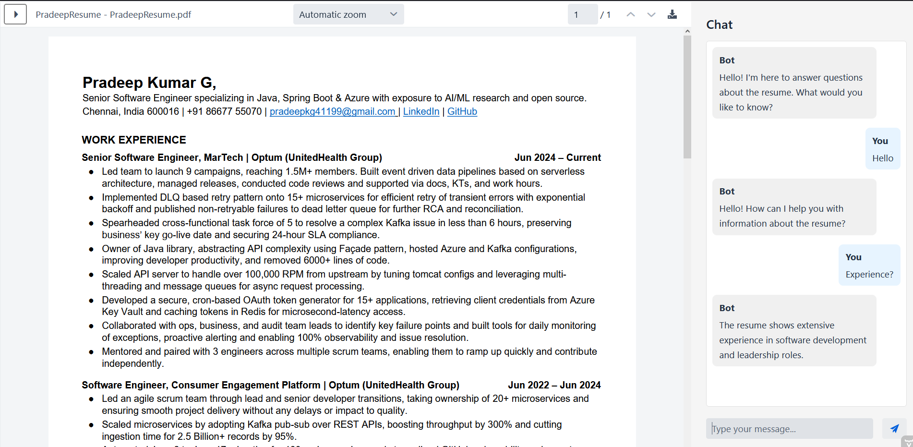

# Resume Chat



## Overview

Resume Chat is an interactive resume viewing application built with Spring Boot and Vaadin. It provides a user-friendly interface for viewing resumes in PDF format along with an interactive chat feature that allows users to ask questions about the resume content.

## Features

- **PDF Resume Viewer**: View resumes in PDF format with a clean, responsive interface.
- **Chatbot**: Ask questions about the resume and get instant responses.
- **Responsive Design**: Works on desktop and mobile devices.
- **Easy Navigation**: Simple and intuitive user interface.

## Technologies Used

- Java 24
- Spring Boot 3.5.0
- Vaadin 24.3.0
- Maven
- PDF Viewer Component

## Prerequisites

- Java Development Kit (JDK) 24 or later
- Maven 3.6 or later
- Web browser (Chrome, Firefox, Safari, or Edge)

## Installation and Setup

1. Clone the repository:
   ```
   git clone https://github.com/yourusername/resumemaker.git
   cd resumemaker
   ```

2. Build the application:
   ```
   mvn clean install
   ```

3. Run the application:
   ```
   mvn spring-boot:run
   ```

4. Access the application:
   Open your web browser and navigate to `http://localhost:8080`.

## Usage

1. **Viewing a Resume**:
   - The resume PDF is displayed in the main panel.
   - Use the PDF viewer controls to zoom, scroll, and navigate through the resume.

2. **Using the Chat Feature**:
   - The chat panel is located on the right side.
   - Type your question in the text field at the bottom of the chat panel.
   - Press Enter or click the send button to submit your question.
   - The application will respond with relevant information about the resume.

3. **Example Questions**:
   - "What experience does this person have?"
   - "What is their educational background?"
   - "What skills do they have?"
   - "How can I contact them?"

## Development

### Todo
- [ ] Integrate with LLM using Spring AI.
- [ ] Enable 'Enter to Send' message in chat.
- [ ] Make the site live and publicly accessible.
- [ ] Gather and Display Site Metrics.

### Project Structure

- `src/main/java/org/oss/resumemaker/ui/`: UI components
  - `MainView.java`: Main application view with PDF viewer and chat
  - `ChatView.java`: Interactive chat component
- `src/main/resources/`: Application resources
  - `application.properties`: Application configuration
  - `PradeepResume.pdf`: Sample resume PDF

### Building from Source

```
mvn clean package
```

This will create a runnable JAR file in the `target` directory.

## License

This project is open source and available under the [MIT License](LICENSE).

## Contributing

Contributions are welcome! Please feel free to submit a Pull Request.

## Support

If you encounter any issues or have questions, please file an issue on the GitHub repository.
